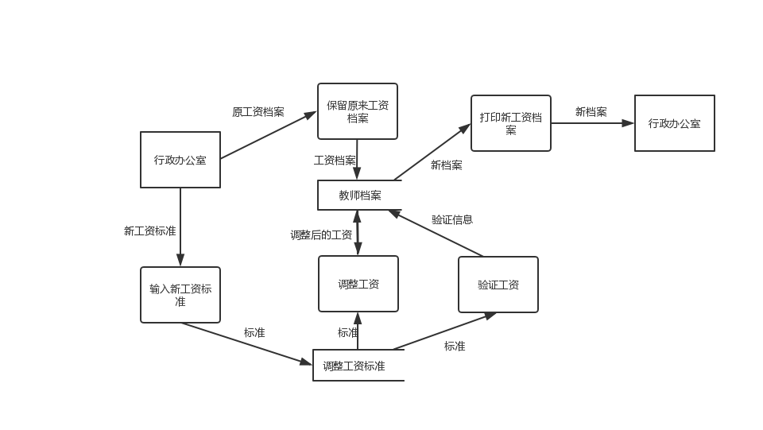
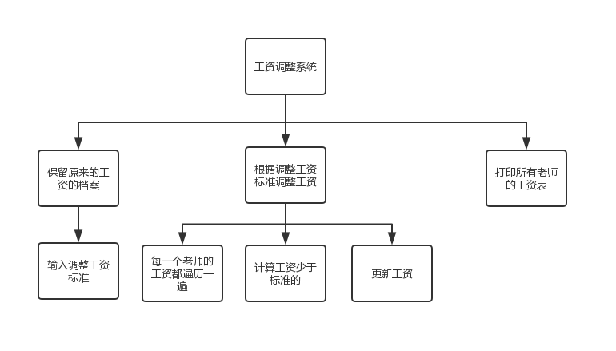

## 演示DEMO
[http://www.willdove.top/weixin/homework/topic4.html](http://www.willdove.top/weixin/homework/topic4.html)

## 数据流图

## 需求分析
1.功能需求
>开局可以发两个人的牌
>
>根据两个人的牌判断输赢
>
>记录游戏次数，并且计算每种情况的概率

2.性能需求
>软件的响应时间少于0.5s

3.可靠性和可用性需求
>不能出现判断错误的情况

4.出错处理需求
>出现错误时，要求给出提示或者警告

## 软件结构
### a方案

### b方案
