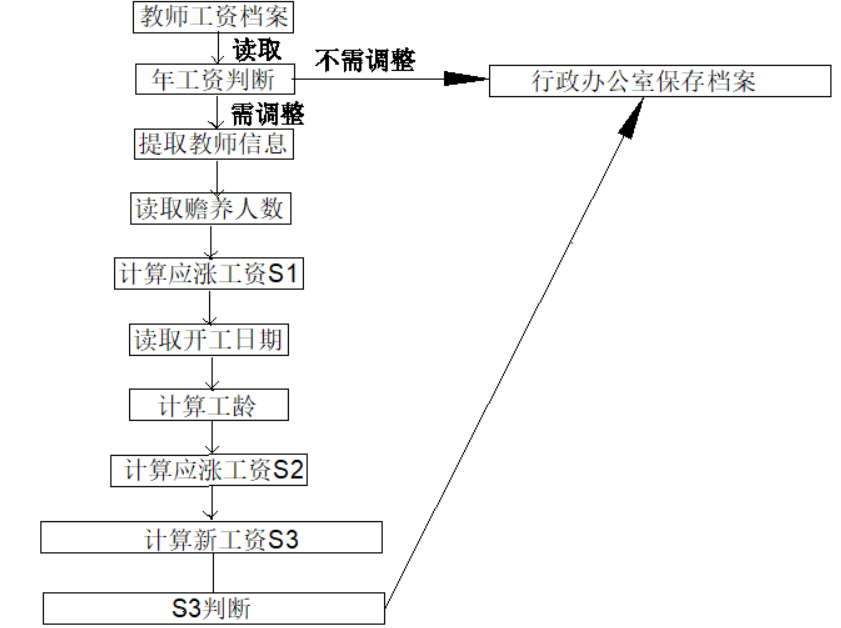

# 一、	任务概述    #
## 1.	需求说明   ##
1.  功能需求：读取教师档案，经过系统工资调整后给出新的教师档案， 并将档案存储在行政办公室。
2． 性能需求：能够以较快速度给出档案中所有工作人员的新工资（不多于2s）。  
3． 故障处理要求：出现错误时，应给予警告或提示
## 2.	数据流图    ##

# 二、	内部结构   #
## 1.	具体内容   ##
教师工资档案：
工号、姓名、工资、赡养人数、入职年
系统：
年工资标准、新工资计算
## 2.	HIPO图   ##
